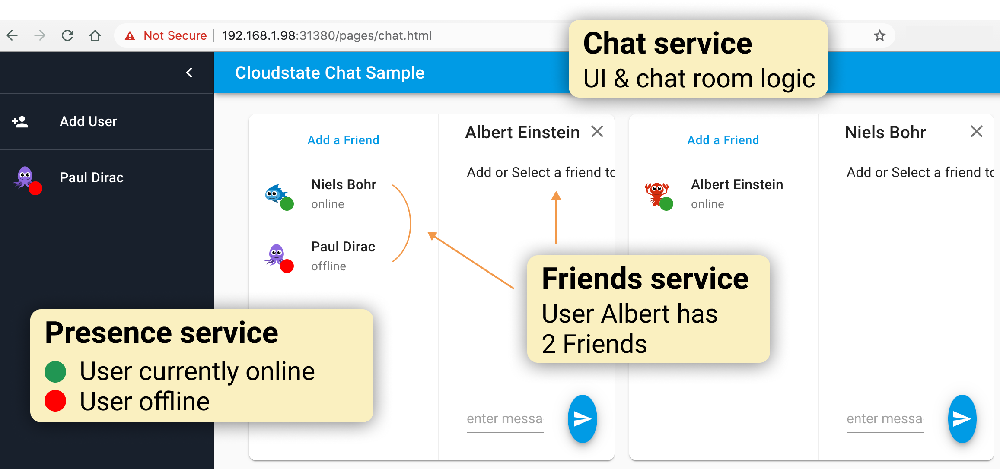

= Friends & Presence service - part of Cloudstate Chat sample
Lightbend, 2020
Version 2.0, 2020-06-22
:description: Friends and Presence stateful services, part of the Cloudstate chat sample https://github.com/cloudstateio/samples-ui-chat
:keywords: Cloudstate, stateful serverless, chat-sample
:sectnums:
:toc:
ifdef::env-github[]
:tip-caption: :bulb:
:note-caption: :information_source:
:important-caption: :heavy_exclamation_mark:
:caution-caption: :fire:
:warning-caption: :warning:
endif::[]

== Overview

NOTE: This sample is a work-in-progress, and is not up-to-date with the latest changes in Cloudstate or Lightbend Cloudstate. Please see the https://github.com/cloudstateio/samples-ui-shoppingcart[Shopping Cart samples] for the most recent examples of a Cloudstate app instead.

This is the implementation of the `Friends` and `Presence` services, which are part of https://github.com/cloudstateio/samples-ui-chat[Lightbend Cloudstate Chat Sample]. The code is written in JavaScript and runs as a Node.js server. The screenshot below shows the user interface of the chat application:

{nbsp} +

- <<friends/README.adoc#friends-service-overview,Friends>> is a stateful service, using an https://cloudstate.io/docs/core/current/user/features/crdts.html#crdts-available-in-cloudstate[Observed-Removed Set ORSet CRDT] to store/retrieve the list of friends of a user.

- <<presence/README.adoc#presence-service-overview,Presence>> is a stateful service, using a https://cloudstate.io/docs/core/current/user/features/crdts.html#crdts-available-in-cloudstate[Vote CRDT] to store/retrieve the online status of a user.

== Tutorial

The `Friends` and `Presence` services have no User Interface. In this repository, we build these services and test them using `docker` and `grpcurl`.

A detailed tutorial is described in <<friends/README.adoc#javascript-implementation, JavaScript implementation of the Friends service>>. As the design of these services is quite similar, it is not necessary to repeat for the `Presence` service.

== Deployment - Managed Cloud Lightbend Cloudstate

=== Deploying to Lightbend Cloudstate

The following steps use `akkasls` to deploy the application to [Lightbend Cloudstate](https://docs.cloudstate.com/).

=== Prerequisites

* Get [Your Lightbend Cloudstate Account](https://docs.cloudstate.com/getting-started/lightbend-account.html)
* Install [akkasls](https://docs.cloudstate.com/getting-started/set-up-development-env.html)

=== Login to Lightbend Cloudstate

----
$ akkasls auth login
----

=== Create a new project

----
$ akkasls projects new sample-chat "Chat Sample"
----

Wait until you receive an email approving your project!

List projects:

----
$ akkasls projects list
----

You should see the project listed:

----
  NAME                   DESCRIPTION            STATUS   ID
  sample-chat   Chat Sample   active   39ad1d96-466a-4d07-b826-b30509bda21b
----

You can change the current project:

----
$ akkasls config set project sample-chat
----

=== Deploying the chat service

A pre-built container image of the `friends` service has been provided at `lightbend-docker-registry.bintray.io/cloudstate-samples/friends`.
If you have built your own container image, change the image in the following command to point to the one that you just pushed.

----
$ akkasls svc deploy \
    friends \
    lightbend-docker-registry.bintray.io/cloudstate-samples/friends
----

Wait for the friends service `STATUS` to be `ready`.

----
$ akkasls svc get
----

=== Expose the friends service

----
$ akkasls svc expose friends --enable-cors
----

The output will look like this:

----
Service 'friends' was successfully exposed at: small-fire-5330.us-east1.apps.lbcs.io
----

Make a note of the hostname since it will be used by the `frontend` static html page.

*Repeate the above process replaceing `friends` with the word `presence` to deploy your presence service.*

=== Visit the chat web frontend

Open a browser and go to the following url: [https://static.cloudstate.com/js-chat/index.html](https://static.cloudstate.com/js-chat/index.html)

Once the page has loaded your will see a dialog prompting you to enter the hostname for your exposed (and CORS enabled) `friends` service.

In the example above, the hostname would be:
----
small-fire-5330.us-east1.apps.lbcs.io
----

== Deployment - Kubernetes Open Source Cloudstate

It is at deployment time, when all the services collaborate together that we can really appreciate the true benefits of a serverless deployment model. In particular in terms of their stateful and serverless abilities. By using https://github.com/cloudstateio/cloudstate[Cloudstate] library and deploying on Kubernetes, your services store and retrieve state without requiring you to write any code nor manage any storage.

The deployment is described in details in the https://github.com/cloudstateio/samples-ui-chat[Cloudstate Chat Sample]. The deployment is mentioned as a heads-up showing the big picture of the end result. We don't have yet all the constituants to deploy the entire Chat application.

Our goal here is to build and test the `Friends` and `Presence` services. For now, the first step is to setup the dev environment. We will get to the Chat application deployment after we would have successfully tested these services.

[[tool-prerequisites]]
== Tools Prerequisites

=== Docker

Cloudstate services are deployed on a cluster complying to Kubernetes deployment model. Docker is used to package the Cloudstate-aware service that you design into a container.

* Install https://www.docker.com/get-started[Docker]
** Check with `docker version`, version v19.03+ is recommended

=== gRPCurl for testing gRPC servers

The communication between the Cloudstate `user-function` uses the gRPC protocol. https://github.com/fullstorydev/grpcurl[gRPCurl] is a command-line tool allowing to query gRPC servers in the same fashion as `curl` with REST servers.

`gRPCurl` is not a deployment tool per-se. It is used to make a quick integration test of your services before deployment.

https://github.com/fullstorydev/grpcurl#installation[Install gRPCurl] from `brew` if you are on macOS or directly from binaries for other OS. If the installation is successful, you should be able to invoke `grpcurl -version` in a terminal:

[source,shell]
----
$ grpcurl -version
grpcurl 1.6.0
----

=== Optional for Local JavaScript Development

`nvm` and `npm` tools are NOT needed to build the Docker images, deploy and test the `Friends` and `Presence` services. In case you want to play around with the JavaScript code you need to install:

* Install https://github.com/nvm-sh/nvm#install--update-script[nvm] (node version manager)
** Check with `nvm --version`, version 0.34.0+ recommended
* Install https://www.npmjs.com/get-npm[npm] (node package manager)
** Check with `npm -v`, version 6.14.3+ recommended

*(end)*
