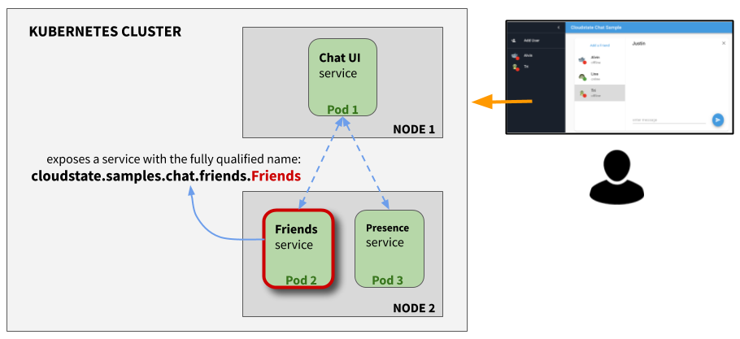
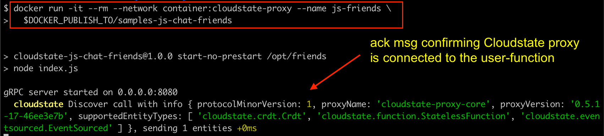

= Friends service - part of Cloudstate Chat sample
Lightbend, 2020
Version 2.0, 2020-06-15
:description: "Friends" stateful service, part of the Cloudstate chat sample https://github.com/cloudstateio/samples-ui-chat
:keywords: Cloudstate, stateful serverless, chat-sample
:sectnums:
:toc:
ifdef::env-github[]
:tip-caption: :bulb:
:note-caption: :information_source:
:important-caption: :heavy_exclamation_mark:
:caution-caption: :fire:
:warning-caption: :warning:
endif::[]

== Overview of the Friends service

This is an implementation of the `Friends` service, which is part of Lightbend Cloudstate https://github.com/cloudstateio/samples-ui-chat[Chat sample]. The code is written in Javascript and runs as a node.js server. The screenshot below shows the user interface of the chat application:

image::../docs/Cloudstate_Sample_ChatApplication.png[Cloudstate Sample - Chat Application]
{nbsp} +

`Friends` is a stateful service which has no UI. Its function is to manage the state of the user entity:

* entity key = `User` defined by the user name
* value = `FriendsList` which is a list of `Friend`. A `Friend` is an object defined by an user name and an avatar icon.

We will see the detailed schema of the entities in the <<friends-service-descriptor>> section. For now let's just visualize how the state of the `Friends` service is rendered in the chat UI:

* User "Albert" has 2 friends (Niels and Paul)

The tracking of the online/offline status is delegated to a separate service named <<../presence/README.adoc#,Presence>>. The diagram below shows the chat application is architected as 3 microservices, deployed in a Kubernetes cluster. For now, let's ignore how the user access the Chat UI using a browser and how the Chat UI service communicates with other services. The application flow is explained in https://github.com/cloudstateio/samples-ui-chat[Chat sample]. In this section, we focus only on the design of the `Friends` service as stateful serverless using https://github.com/cloudstateio/cloudstate[Cloudstate]

[[javascript-implementation,Javascript implementation of the Friends service]]
== Javascript implementation of the Friends service

The `Friends` service is *stateful*, ie. the state of the user entity is fully preserved. If the user entity went out of scope in the Chat UI (eg. user disconnected or closed the browser). When the user connects back again, the Chat UI invokes the `Friends` service to retrieve the state (ie. the `FriendsList`).

The friends service is backed by a CRDT using an https://cloudstate.io/docs/core/current/user/features/crdts.html#crdts-available-in-cloudstate[Observed-Removed Set (ORSet)] to store the user's `FriendsList`.

In this tutorial, we won't go into depth of Cloudstate itself and how to use it, the https://cloudstate.io/docs/core/current/user/features/index.html[Cloudstate Overview documentation] is a good place to start to learn about Cloudstate.

First create the npm `package.json` file:

[source,JSON]
----
{
  "dependencies": {
    "cloudstate": "0.0.2"
  },
  "scripts": {
    "prestart": "compile-descriptor friends.proto",
    "start": "node index.js",
    "start-no-prestart": "node index.js"
  }
}
----

We've defined a `prestart` method that compiles the gRRC descriptor (that we'll create in a moment), and a `start` method that will run our entity. We've also defined a `start-no-prestart` method, this will be used by our Docker image to run it without compiling the descriptor each time. Speaking of Docker, let's also create a `Dockerfile`:

.Dockerfile
[source,Dockerfile]
----
FROM node:12.16.3-buster-slim

WORKDIR /opt/friends
COPY package*.json ./
RUN npm install
COPY . .
RUN npm run prestart
EXPOSE 8080
ENV DEBUG=cloudstate*
ENTRYPOINT [ "npm", "run", "start-no-prestart" ]
----

And an accompanying `.dockerignore` file that ignores the `node_modules` directory and npm log file. This helps to keep the docker image size minimal.

..dockerignore
----
node_modules
npm-debug.log
----

Now that we're setup, the first thing to do is create the gRPC interface that our `Friends` service will implement. Create a file named `friends.proto` with the following content:

[[friends-service-descriptor,Friends service descriptor]]
.friends.proto: the GRPC service descriptor of the `Friends` service
[source,protobuf]
----
syntax = "proto3";

import "cloudstate/entity_key.proto";

package cloudstate.samples.chat.friends;

message Friend{
    string user = 1;
    string avatar = 2;
}

message FriendRequest {
    string user = 1 [(.cloudstate.entity_key) = true];
    Friend friend = 2;
}

message User {
    string user = 1 [(.cloudstate.entity_key) = true];
}

message FriendsList {
    repeated Friend friends = 1;
}

message Empty {
}

service Friends {
    rpc Add(FriendRequest) returns (Empty);
    rpc Remove(FriendRequest) returns (Empty);
    rpc GetFriends(User) returns (FriendsList);
}
----

This is a fairly unremarkable interface, it supports adding friends, removing friends and getting a list of friends. The one thing that is not standard is the use of `cloudstate.entity_key` annotations. This indicates to the Cloudstate proxy (more on that later) how to determine which entity an incoming request is for. In the above example, the `user` field on the `User` and `FriendRequest` messages is annotated as "entity key". Which indicates our entities are identified by the user that owns them. The Cloudstate proxy takes care of maintaining the state (the CRDT representing the `FriendList`) for that user entity.

Now we create the code. Open a file called `index.js`. First some setup code:

[source,JavaScript]
----
const crdt = require("cloudstate").crdt;

const entity = new crdt.Crdt(
  "friends.proto",
  "cloudstate.samples.chat.friends.Friends"
);

entity.defaultValue = () => new crdt.ORSet();
----

We've imported the Cloudstate CRDT support, created a new CRDT entity that is served by the `Friends` gRPC service in `friends.proto`, and we've set a default value for the entity, should a command come in and no CRDT has yet been created for it, the value will bne defaulted to an empty ORSet.

Now we define some command handlers:

[source,JavaScript]
----
function add(friend, ctx) {
  ctx.state.add(friend.friend);
  return {};
}

function remove(friend, ctx) {
  ctx.state.delete(friend.friend);
  return {};
}

function getFriends(user, ctx) {  
  return {
    friends: Array.from(ctx.state)
  };
}
----

It's just a set, the first parameter passed in to each handler is the gRPC method parameter, for `add` and `remove` that's a `FriendRequest` message containing the friend to add or remove. The second parameter is the context, this, among other things, holds the current CRDT state (ie, the ORSet that we created before as the default value).

Finally, we'll wire the command handlers up and start the gRPC server that will serve the entity:

[source,JavaScript]
----
entity.commandHandlers = {
  Add: add,
  Remove: remove,
  GetFriends: getFriends
};

entity.start();
----

== Building the Friends service
=== Javascrip dev environment setup
include::../docs/js-dev-setup.adoc[]

=== Build the Docker image

Build a docker image with the following name attributes:

* Docker registry ID. Let's assume your DockerID on https://hub.docker.com/ is `mydockerregistry`
* image name: `samples-js-chat-friends`
* version: `latest`

The docker image tag will be `mydockerregistry/samples-js-chat-friends:latest`

[source,shell]
----
cd ./friends

nvm install
nvm use
npm install
npm run prestart

DOCKER_PUBLISH_TO=mydockerregistry

# build docker image
docker build . -t $DOCKER_PUBLISH_TO/samples-js-chat-friends:latest

# authenticate with your Docker registry
docker login

# push the docker image to your registry
docker push $DOCKER_PUBLISH_TO/samples-js-chat-friends:latest
----

== Testing

[[testing-start-service]]
=== Starting the service

We cannot test the `Friends` service by querying it directly. Why is that? In the <<javascript-implementation>> section, the Javascript code we wrote barely defines the data schema and the behavior of the service. And yet we have a full blown stateful service, ie. the service is able to store/retrieve the `FriendList` of an user entity. And this, with the benefits of scalability and high availability, without writing any code for the state storage & retrieval.

Our `Friends` service gains the state management ability thanks to Cloudstate. In Cloudstate terminology, the service we developped, here the Friends Javascript code, is called a `user-function`. As shown in https://cloudstate.io/docs/core/current/user/features/index.html[Using Cloudstate, Overview], the `user-function` communicates with the outside world via the intermediary of a Cloudstate proxy. This proxy "undertands" the data schema and behavior of our service (the `user-function`) thanks to the https://github.com/cloudstateio/samples-js-chat/blob/master/friends/friends.proto[Service descriptor]. So that the proxy is able to enrich the communication to our service with state management.

image::https://cloudstate.io/docs/core/current/user/features/overview.svg[Cloudstate Overview,480,315,align="center",link="https://cloudstate.io/docs/core/current/user/features/index.html"]
{nbsp} +

In the remaining of this guide, `Friends` is referred to by multiple qualifications which are identical. The wording will be chosen to best suit the context:

* `Friends` is a *service* from the business point of view
* `Friends` is a *microservice* in terms of architecture design
* `Friends` is a *user-function* in the context of Cloudstate

Therefore, to test our `Friends` service we need both the Cloudstate proxy and our own `Friends` user-function to be running. We use https://docs.docker.com/engine/reference/commandline/run/[docker run] to run two images:

* The Cloudstate proxy, which exposes the entrypoint to test the service. This image is already prebuilt for us by Cloudstate dev team. We can get it at `cloudstateio/cloudstate-proxy-dev-mode`
* The Cloudstate `user-function`, which is the Friends service we have already built above into the docker image `samples-js-chat-friends`

[source,shell]
----
# terminal 1: run the cloudstate proxy docker image
# exposing the CS proxy port 9000 to the same 9000 on the host machine
# NOTE: ignore the connection errors b/c the `user-function` is not yet started
docker run -it --rm --name cloudstate-proxy -p 9000:9000 \
  cloudstateio/cloudstate-proxy-dev-mode \
  -Dcloudstate.proxy.user-function-port=8080 \
  -Dcloudstate.proxy.user-function-interface=samples-js-chat-friends

# terminal 2: run the docker image of the `user-function`
# within the SAME network namespace as the CS proxy
DOCKER_PUBLISH_TO=mydockerregistry

docker run -it --rm --network container:cloudstate-proxy --name js-friends \
  $DOCKER_PUBLISH_TO/samples-js-chat-friends
----

=== Testing the GRPC service 

With a new terminal session, we can use https://github.com/fullstorydev/grpcurl[gRPCurl] to test our service. Make sure you have installed gRPCurl as mentioned in the <<Javascrip dev environment setup>> section.

Discover the services exposed at our gRPC server, implemented by the Cloudstate proxy:
[source,shell]
----
$ grpcurl -plaintext localhost:9000 list

# console output
cloudstate.samples.chat.friends.Friends
grpc.reflection.v1alpha.ServerReflection
----

Then inspect the metadata of the `Friends` service
[source,shell]
----
$ grpcurl -plaintext localhost:9000 describe cloudstate.samples.chat.friends.Friends

# console output
cloudstate.samples.chat.friends.Friends is a service:
service Friends {
  rpc Add ( .cloudstate.samples.chat.friends.FriendRequest ) returns ( .cloudstate.samples.chat.friends.Empty );
  rpc GetFriends ( .cloudstate.samples.chat.friends.User ) returns ( .cloudstate.samples.chat.friends.FriendsList );
  rpc Remove ( .cloudstate.samples.chat.friends.FriendRequest ) returns ( .cloudstate.samples.chat.friends.Empty );
}
----

Now let's test the `Add` and `GetFriends` methods. These methods requires input parameters which should be serialized as JSON string. The data schema is defined in https://github.com/cloudstateio/samples-js-chat/blob/master/friends/friends.proto[Friends service descriptor]. Or use `grpcurl ... describe cloudstate.samples.chat.friends.Friends.FriendRequest` to get the schema.

[source,shell]
----
$ grpcurl -plaintext -d '{"user": "Albert", "friend": {"user":"Neils", "avatar":"img2.png"}}' \
  localhost:9000 \
  cloudstate.samples.chat.friends.Friends/Add

$ grpcurl -plaintext -d '{"user": "Albert", "friend": {"user":"Paul", "avatar":"img3.png"}}' \
  localhost:9000 \
  cloudstate.samples.chat.friends.Friends/Add

$ grpcurl -plaintext -d '{"user": "Albert"}' \
  localhost:9000 \
  cloudstate.samples.chat.friends.Friends/GetFriends

# console output
{
  "friends": [
    {
      "user": "Neils",
      "avatar": "img2.png"
    },
    {
      "user": "Paul",
      "avatar": "img3.png"
    }
  ]
}
----

NOTE: You can also monitor the request/response activities of the GRPC server by checking the logs in the terminal sessions running the 2 docker images (the Cloudstate proxy and the `user-function` of the `Friends` service).

== Deployment

The deployment is described in details in the https://github.com/cloudstateio/samples-ui-chat[Cloudstate Chat Sample]. This is a chat room application with a basic UI allowing to test the integration of multiple Cloudstate services collaborating together.
