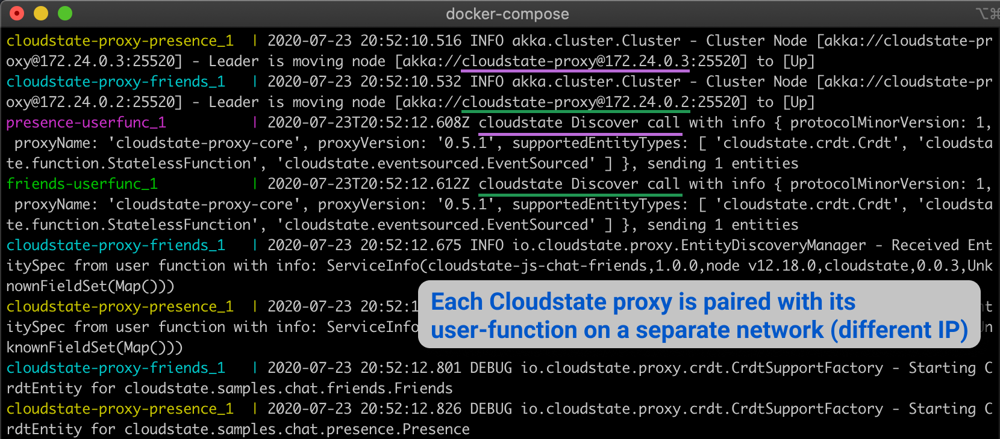

= Friends service - part of Cloudstate Chat sample
Lightbend, 2020
Version 2.0, 2020-06-15
:description: "Friends" stateful service, part of the Cloudstate chat sample https://github.com/cloudstateio/samples-ui-chat
:keywords: Cloudstate, stateful serverless, chat-sample
:sectnums:
:toc:
ifdef::env-github[]
:tip-caption: :bulb:
:note-caption: :information_source:
:important-caption: :heavy_exclamation_mark:
:caution-caption: :fire:
:warning-caption: :warning:
endif::[]

[[friends-service-overview]]
== Friends service - Overview

`Friends` is a stateful service which has no User Interface. Its function is to manage the state of the user entity:

* entity key = `User` defined by the user name
* value = `FriendsList` which is a list of `Friend`. A `Friend` is an object defined by an user name and an avatar icon.

We will see the detailed schema of the entities in the <<friends-service-descriptor>> section. For now let's just visualize how the state of the `Friends` service is rendered in the <<../README.adoc#Overview,Chat UI overview>>: The user "Albert" has 2 friends, Niels and Paul.

The diagram below shows that the chat application is architected as 3 microservices and deployed on a Kubernetes cluster. For now, let's ignore how the user access the Chat UI using a browser and how the Chat UI service communicates with other services. The application flow is explained in the https://github.com/cloudstateio/samples-ui-chat[Cloudstate Chat Sample].

In this section, we focus only on the design of the `Friends` service as stateful serverless using https://github.com/cloudstateio/cloudstate[Cloudstate].

image::../docs/ChatAppDiagram_HighlightFriendService.png[Chat Sample Diagram]

[[javascript-implementation,JavaScript implementation of the Friends service]]
== JavaScript implementation of the Friends service

The `Friends` service is *stateful* where the state of the user entity is fully preserved. For example, in the Chat UI, if the user disconnects or closes the browser, this will cause the user entity to go out of scope. When the user connects back again, the Chat UI invokes the `Friends` service to retrieve the state, and restores the `FriendsList` back to the user entity.

The friends service is backed by a CRDT using an https://cloudstate.io/docs/core/current/user/features/crdts.html#crdts-available-in-cloudstate[Observed-Removed Set (ORSet)] to store the user's `FriendsList`.

In this tutorial, we won't go into depth of Cloudstate itself and how to use it, the https://cloudstate.io/docs/core/current/user/features/index.html[Cloudstate Overview documentation] is a good place to start to learn about Cloudstate.

First we create some files common to Node.js development and building Docker image:

* https://github.com/cloudstateio/samples-js-chat/blob/master/friends/package.json[package.json]
* https://github.com/cloudstateio/samples-js-chat/blob/master/friends/Dockerfile[Dockerfile]

Now that we're setup, the first thing to do is create the gRPC interface that our `Friends` service will implement. Create a file named `friends.proto` with the following content:

[[friends-service-descriptor,Friends service descriptor]]
.friends.proto: the gRPC service descriptor of the `Friends` service
[source,protobuf]
----
syntax = "proto3";

import "cloudstate/entity_key.proto";

package cloudstate.samples.chat.friends;

message Friend{
    string user = 1;
    string avatar = 2;
}

message FriendRequest {
    string user = 1 [(.cloudstate.entity_key) = true];
    Friend friend = 2;
}

message User {
    string user = 1 [(.cloudstate.entity_key) = true];
}

message FriendsList {
    repeated Friend friends = 1;
}

message Empty {
}

service Friends {
    rpc Add(FriendRequest) returns (Empty);
    rpc Remove(FriendRequest) returns (Empty);
    rpc GetFriends(User) returns (FriendsList);
}
----

This is a fairly unremarkable interface, it supports adding friends, removing friends and getting a list of friends. The one thing that is not standard is the use of `cloudstate.entity_key` annotations. This indicates to the Cloudstate proxy (more on that later) how to determine which entity an incoming request is for. In the above example, the `user` field on the `User` and `FriendRequest` messages is annotated as an "entity key". Which indicates our entities are identified by the user that owns them. The Cloudstate proxy takes care of maintaining the state (the CRDT representing the `FriendList`) for that user entity.

Open a file called `index.js`. First, we add some setup code:

[source,JavaScript]
----
const crdt = require("cloudstate").crdt;

const entity = new crdt.Crdt(
  "friends.proto",
  "cloudstate.samples.chat.friends.Friends"
);

entity.defaultValue = () => new crdt.ORSet();
----

We've imported the Cloudstate CRDT support, created a new CRDT entity that is served by the `Friends` gRPC service in `friends.proto`, and we've set a default value for the entity, should a command come in and no CRDT has yet been created for it, the value will be defaulted to an empty ORSet.

Next, we define some command handlers:

[source,JavaScript]
----
function add(friend, ctx) {
  ctx.state.add(friend.friend);
  return {};
}

function remove(friend, ctx) {
  ctx.state.delete(friend.friend);
  return {};
}

function getFriends(user, ctx) {
  return {
    friends: Array.from(ctx.state)
  };
}
----

It's just a set, the first parameter passed in to each handler is the gRPC method parameter, for `add` and `remove` that's a `FriendRequest` message containing the friend to add or remove. The second parameter is the context, this, among other things, holds the current CRDT state (ie, the ORSet that we created before as the default value).

Finally, we'll wire the command handlers up and start the gRPC server that will serve the entity:

[source,JavaScript]
----
entity.commandHandlers = {
  Add: add,
  Remove: remove,
  GetFriends: getFriends
};

entity.start();
----

[[building-the-friends-service]]
== Building the Friends service

=== Build the Docker image

Build a docker image with the following name attributes:

* Docker registry ID. Let's assume your DockerID on https://hub.docker.com/ is `mydockerregistry`
* image name: `chat-friends-js`
* version: `latest`

The docker image tag will be `mydockerregistry/chat-friends-js:latest`

[source,shell]
----
cd ./friends

DOCKER_PUBLISH_TO=mydockerregistry

# build docker image
docker build . -t $DOCKER_PUBLISH_TO/chat-friends-js:latest

# authenticate with your Docker registry
docker login

# push the docker image to your registry
docker push $DOCKER_PUBLISH_TO/chat-friends-js:latest
----

[[testing-friends-service]]
== Testing Friends service

=== Need a Cloudstate proxy

We cannot test the `Friends` service by querying it directly. Why is that? In the <<javascript-implementation>> section, the JavaScript code we wrote barely defines the data schema and the behavior of the service. And yet we have a full blown stateful service, ie. the service is able to store/retrieve the `FriendList` of an user entity. And this, with the benefits of scalability and high availability, without writing any code for the state storage & retrieval.

Our `Friends` service gains the state management ability thanks to Cloudstate. In Cloudstate terminology, the service we developed, here the Friends JavaScript code, is called a `user-function`. As shown in https://cloudstate.io/docs/core/current/user/features/index.html[Using Cloudstate, Overview], the `user-function` communicates with the outside world via the intermediary of a Cloudstate proxy. This proxy "understands" the data schema and behavior of our service (the `user-function`) thanks to the https://github.com/cloudstateio/samples-js-chat/blob/master/friends/friends.proto[Service descriptor]. So that the proxy is able to enrich the communication to our service with state management.

image::https://cloudstate.io/docs/core/current/user/features/overview.svg[Cloudstate Overview,480,315,align="center",link="https://cloudstate.io/docs/core/current/user/features/index.html"]
{nbsp} +

In the remaining of this guide, `Friends` is referred to by multiple qualifications which are identical. The wording will be chosen to best suit the context:

* `Friends` is a *service* from the business point of view
* `Friends` is a *microservice* in terms of architecture design
* `Friends` is a *user-function* in the context of Cloudstate

Therefore, to test our `Friends` service we need both the Cloudstate proxy and our own `Friends` user-function to be running. To achieve that, we need two docker images:

* The Cloudstate proxy, which exposes the entrypoint to test the `Friends` service. This image is already prebuilt for us by the Cloudstate project. We can get it at `cloudstateio/cloudstate-proxy-dev-mode:0.5.1`
* The Cloudstate `user-function`, which is the Friends service we have already built above into the docker image `chat-friends-js`

=== Customize docker-compose.yaml

We use https://docs.docker.com/compose/#compose-documentation[docker-compose] to run these docker images together. Before starting, you must edit https://github.com/cloudstateio/samples-js-chat/blob/master/docker-compose.yaml[docker-compose.yaml] to replace the prebuilt `chat-friends-js:latest` by your own that you have published in the <<building-the-friends-service,Building the Friends service>> step.

[source,shell]
----
# REPLACE (in docker-compose.yaml)
  friends-impl:
    image: lightbend-docker-registry.bintray.io/cloudstate-samples/chat-friends-js:latest

# BY your own docker image, for example:
  friends-impl:
    image: mydockerregistry/chat-friends-js:latest
----

=== Starting the service

Now we can start the Cloudstate proxy along with the `Friends` service

[source,shell]
----
$ cd (where docker-compose.yaml is located)

$ docker-compose up
----
{nbsp} +

=== Testing with gRPCurl

With a new terminal session, we can use `gRPCurl` to test our service. Make sure you have installed `gRPCurl` as mentioned in the <<../README.adoc#tool-prerequisites,Tools Prerequisites>> section.

Discover the services exposed at our gRPC server, implemented by the Cloudstate proxy:
[source,shell]
----
$ grpcurl -plaintext localhost:9001 list

# console output
cloudstate.samples.chat.friends.Friends
grpc.reflection.v1alpha.ServerReflection
----

Then inspect the metadata of the `Friends` service
[source,shell]
----
$ grpcurl -plaintext localhost:9001 describe cloudstate.samples.chat.friends.Friends

# console output
cloudstate.samples.chat.friends.Friends is a service:
service Friends {
  rpc Add ( .cloudstate.samples.chat.friends.FriendRequest ) returns ( .cloudstate.samples.chat.friends.Empty );
  rpc GetFriends ( .cloudstate.samples.chat.friends.User ) returns ( .cloudstate.samples.chat.friends.FriendsList );
  rpc Remove ( .cloudstate.samples.chat.friends.FriendRequest ) returns ( .cloudstate.samples.chat.friends.Empty );
}
----

Finally, let's test the `Add` and `GetFriends` methods. These methods requires input parameters which should be serialized as JSON string. The data schema is defined in https://github.com/cloudstateio/samples-js-chat/blob/master/friends/friends.proto[Friends service descriptor]. Or use `grpcurl ... describe cloudstate.samples.chat.friends.Friends.FriendRequest` to get the schema.

[source,shell]
----
$ grpcurl -plaintext -d '{"user": "Albert", "friend": {"user":"Neils", "avatar":"img2.png"}}' \
  localhost:9001 \
  cloudstate.samples.chat.friends.Friends/Add

$ grpcurl -plaintext -d '{"user": "Albert", "friend": {"user":"Paul", "avatar":"img3.png"}}' \
  localhost:9001 \
  cloudstate.samples.chat.friends.Friends/Add

$ grpcurl -plaintext -d '{"user": "Albert"}' \
  localhost:9001 \
  cloudstate.samples.chat.friends.Friends/GetFriends

# console output
{
  "friends": [
    {
      "user": "Neils",
      "avatar": "img2.png"
    },
    {
      "user": "Paul",
      "avatar": "img3.png"
    }
  ]
}
----

NOTE: You can also monitor the request/response activities of the gRPC server by checking the logs in the terminal session running `docker-compose`

== Deployment

The deployment is described in details in the https://github.com/cloudstateio/samples-ui-chat[Cloudstate Chat Sample]. This is a chat room application with a basic UI allowing to test the integration of multiple Cloudstate services collaborating together.
