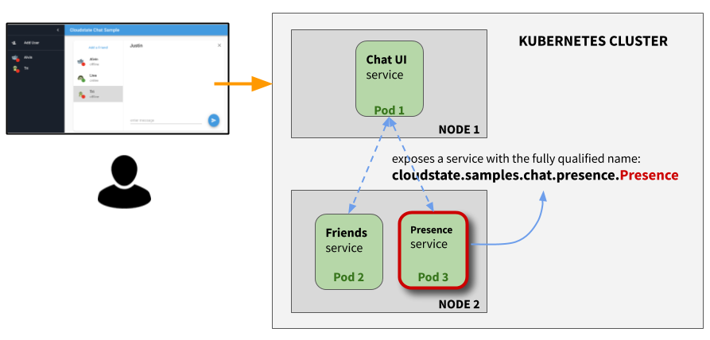

= Presence service - part of Cloudstate Chat sample
Lightbend, 2020
Version 2.0, 2020-06-22
:description: "Presence" stateful service, part of the Cloudstate chat sample https://github.com/cloudstateio/samples-ui-chat
:keywords: Cloudstate, stateful serverless, chat-sample
:sectnums:
:toc:
ifdef::env-github[]
:tip-caption: :bulb:
:note-caption: :information_source:
:important-caption: :heavy_exclamation_mark:
:caution-caption: :fire:
:warning-caption: :warning:
endif::[]

[[presence-service-overview]]
== Presence service - Overview

`Presence` is a stateful service which has no UI. It uses a https://cloudstate.io/docs/core/current/user/features/crdts.html#crdts-available-in-cloudstate[Vote CRDT] 
to track the state (online/offline status) of the user entity:

* entity key = `User` defined by the user name
* value = `OnlineStatus` which is a boolean value

The diagram below shows the chat application is architected as 3 microservices, deployed in a Kubernetes cluster. 

For now, let's ignore the application flow which is explained in https://github.com/cloudstateio/samples-ui-chat[Cloudstate Chat Sample]. Also, we'll skip the coding tutorial which is very similar to that of the `Friends` service: <<../friends/README.adoc#javascript-implementation, Javascript implementation of the Friends service>>. In this section, we focus only on the build and the testing of the `Presence` service:

== Building the Presence service

=== Build the Docker image

Build a docker image with the following name attributes:

* Docker registry ID. Let's assume your DockerID on https://hub.docker.com/ is `mydockerregistry`
* image name: `samples-js-chat-presence`
* version: `latest`

The docker image tag will be `mydockerregistry/samples-js-chat-presence:latest`

[source,shell]
----
cd ./presence

nvm install
nvm use
npm install
npm run prestart

DOCKER_PUBLISH_TO=mydockerregistry

# build docker image
docker build . -t $DOCKER_PUBLISH_TO/samples-js-chat-presence:latest

# authenticate with your Docker registry
docker login

# push the docker image to your registry
docker push $DOCKER_PUBLISH_TO/samples-js-chat-presence:latest
----

== Testing

=== Starting the service

Testing the `Presence` service follows the same procedure as that of the `Friends` service. You may want to read the <<../friends/README.adoc#testing-start-service,Testing Friends service>> section for a more detailed introduction. Here we proceed directly to starting the docker images:

[source,shell]
----
# terminal 1: run the cloudstate proxy docker image
# exposing the CS proxy port 9000 to the same 9000 on the host machine
# NOTE: ignore the connection errors b/c the `user-function` is not yet started
docker run -it --rm --name cloudstate-proxy -p 9000:9000 \
  cloudstateio/cloudstate-proxy-dev-mode \
  -Dcloudstate.proxy.user-function-port=8080 \
  -Dcloudstate.proxy.user-function-interface=samples-js-chat-presence

# terminal 2: run the docker image of the `user-function`
# within the SAME network namespace as the CS proxy
DOCKER_PUBLISH_TO=mydockerregistry

docker run -it --rm --network container:cloudstate-proxy --name js-presence \
  $DOCKER_PUBLISH_TO/samples-js-chat-presence
----

=== Testing the GRPC service 

We can use https://github.com/fullstorydev/grpcurl[gRPCurl] to test our service. Make sure you have installed gRPCurl as mentioned in the <<Javascrip dev environment setup>> section.

Discover the services exposed at our gRPC server, implemented by the Cloudstate proxy:
[source,shell]
----
$ grpcurl -plaintext localhost:9000 list

# console output
cloudstate.samples.chat.presence.Presence
grpc.reflection.v1alpha.ServerReflection
----

Then review the metadata of the `Presence` service
[source,shell]
----
$ grpcurl -plaintext localhost:9000 describe cloudstate.samples.chat.presence.Presence

# console output
cloudstate.samples.chat.presence.Presence is a service:
service Presence {
  rpc Connect ( .cloudstate.samples.chat.presence.User ) returns ( stream .cloudstate.samples.chat.presence.Empty );
  rpc Monitor ( .cloudstate.samples.chat.presence.User ) returns ( stream .cloudstate.samples.chat.presence.OnlineStatus );
}
----

Now let's test the `Connect` and `Monitor` methods. These methods requires input parameters which should be serialized as JSON string. The data schema is defined in https://github.com/cloudstateio/samples-js-chat/blob/master/presence/presence.proto[Presence service descriptor].

The `Connect` and `Monitor` methods return to the client a response as a stream. The client here is the terminal session running `grpcurl`. The client must be listening continuously to receive the response stream (ie. the terminal session looks like it is stuck in an infinite loop).

[source,shell]
----
# Open a terminal session and run (hit Ctrl-C to stop/restart)
$ grpcurl -plaintext -d '{"name": "Albert"}' \
  localhost:9000 \
  cloudstate.samples.chat.presence.Presence/Monitor

# console output: {} means user "Albert" is not yet connected
{
}

# Open a terminal session and run (hit Ctrl-C to stop/restart)
$ grpcurl -plaintext -d '{"name": "Albert"}' \
  localhost:9000 \
  cloudstate.samples.chat.presence.Presence/Connect

# console output:
# - nothing in this terminal
# - however, in the terminal where the `Monitor` method is running, the console should output
{
  "online": true
}
----

NOTE: You can also monitor the request/response activities of the GRPC server by checking the logs in the terminal sessions running the 2 docker images (the Cloudstate proxy and the `user-function` of the `Presence` service).

== Deployment

The deployment is described in details in the https://github.com/cloudstateio/samples-ui-chat[Cloudstate Chat Sample]. This is a chat room application with a basic UI allowing to test the integration of multiple Cloudstate services collaborating together.
